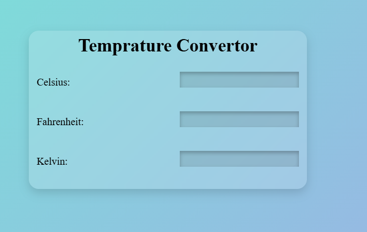

# Temperature Converter

A simple and modern Temperature Converter built using HTML, CSS, and JavaScript.

## Features

- Convert temperatures between Celsius, Fahrenheit, and Kelvin.
- Instant temperature conversion.
- Clean and responsive user interface.
- Works on desktop and mobile devices.

## Technologies Used

- HTML5
- CSS3
- JavaScript

## How It Works

1. Enter a temperature value in any unit.
2. Press **Enter**.
3. The application automatically converts the value into the other two units.

## Project Structure

```text
Temperature Converter/
│
├── index.html
├── style.css
├── script.js
└── README.md
```

## Screenshot



## Live Demo

https://hkkohlio7-code.github.io/Temperature-converter/

## Author

Hemant Kohli

Built as a Javascript practice while learning web development.

updated on June 18 2026